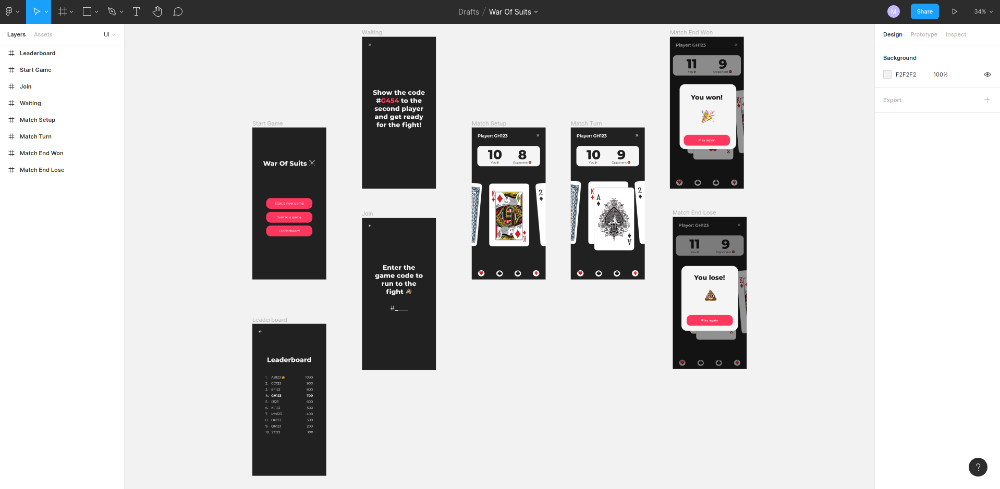
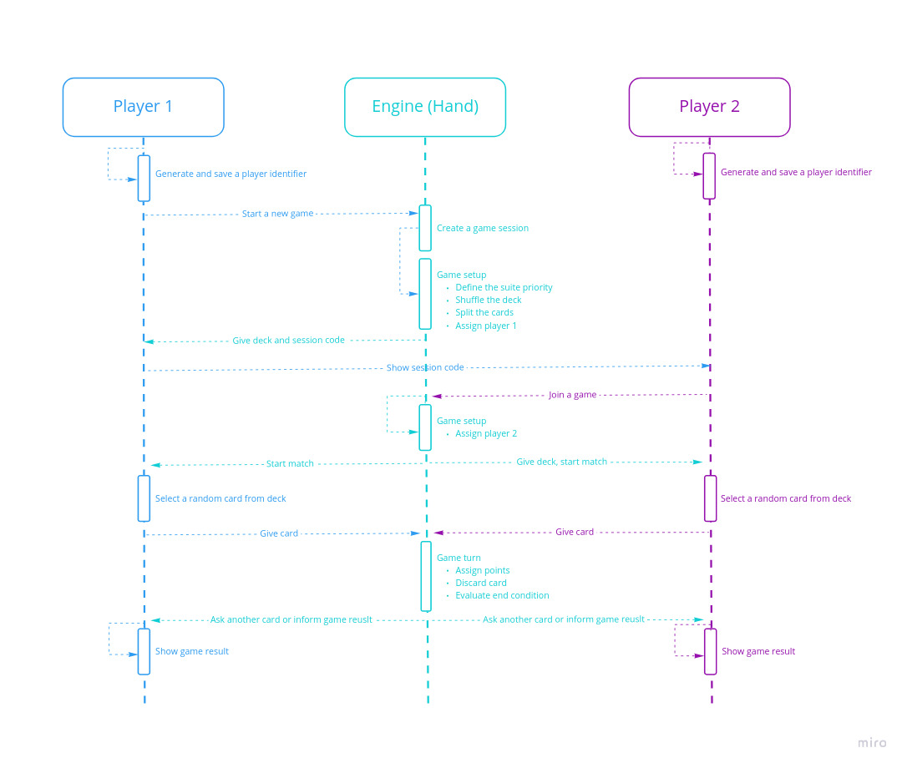
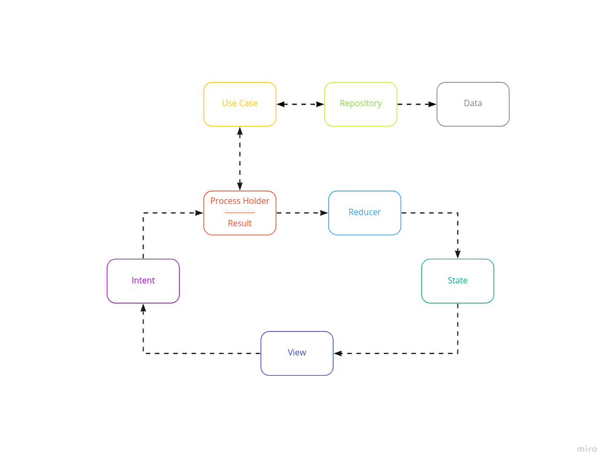
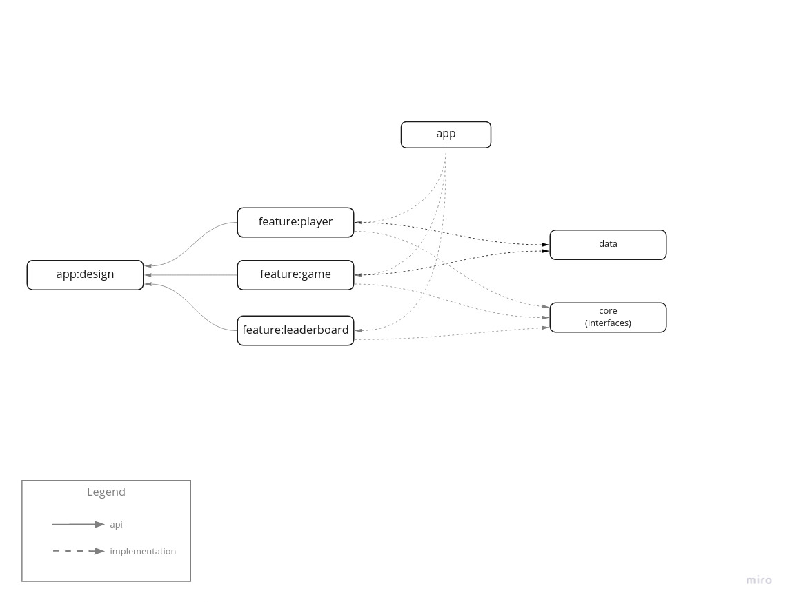

# War Of Suits

Game: https://en.wikipedia.org/wiki/War_(card_game)

### IDE:
Android Studio Arctic Fox | 2020.3.1 Canary 12
Build #AI-203.7148.57.2031.7226969, built on March 22, 2021
(Compose doesn't work out of canary version at the moment)

### JVM:
Runtime version: 11.0.8+0-b944-P17168821 amd64
VM OpenJDK 64-Bit Server VM by N/A

### Versions:
AGP 7.0.0-alpha12
Kotlin 1.4.32
Compose 1.0.0-beta04

## Technologies

UI: Jetpack Compose 
Dependency Injection: Hilt
Reactive Streams: Kotlin Flow
Navigation: Compose Navigation (Fragment-less)
Tests: Espresso Compose, Mockk, Kluent

## UI Design 

## Application FLow

## Architecture

MVI (Unidirectional Data Flow)

Clean Architecture

## Modules

